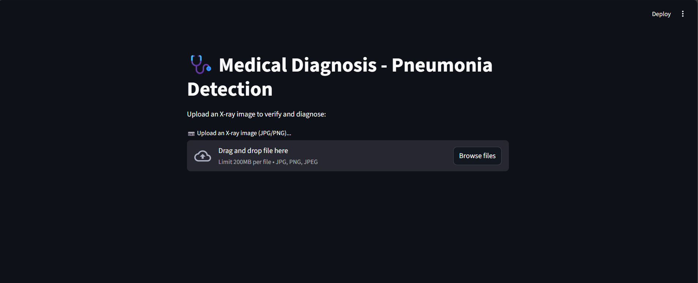
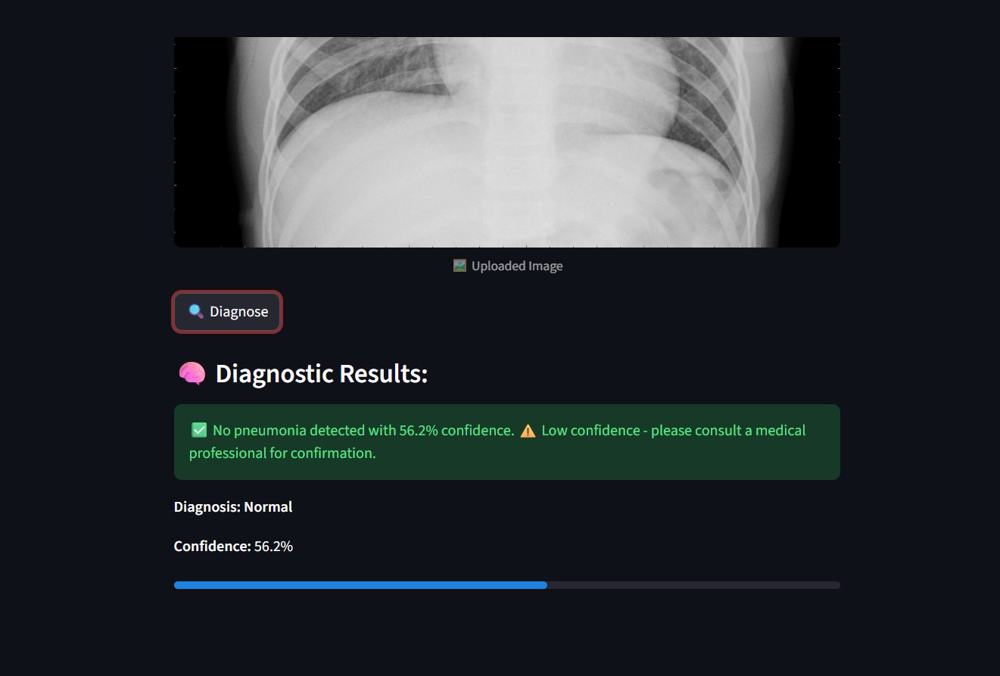

# Medical Imaging Application - Pneumonia Detection

This project is a **medical diagnosis web application** that uses Convolutional Neural Network (CNN) to detect **pneumonia from X-ray images**. It consists of a **FastAPI backend** for model inference and a **Streamlit frontend** for user interaction.

## 🎯 Problem Statement

Following a chest X-ray examination, medical technicians successfully acquire diagnostic images. However, radiologists or healthcare professionals may not be immediately available to interpret the scans and provide a timely diagnosis. This delay can impact patient care, particularly in resource-constrained settings or emergency situations.

**Research Question:** Can a Convolutional Neural Network (CNN) model serve as an automated first-line screening tool to detect pneumonia from chest X-ray scans, providing rapid preliminary assessments while maintaining clinical accuracy?

## 🔬 Solution Approach

This project implements a deep learning-based classification system that:
- Analyzes chest X-ray images using custom CNN architecture trained from scratch
- Provides binary classification (Normal vs. Pneumonia) with confidence scores
- Employs automated hyperparameter tuning for optimal model performance
- Maintains transparency by displaying confidence levels and recommending professional consultation for low-confidence predictions

## 🚀 Features
- **FastAPI Backend**: Handles image processing and model predictions.
- **Streamlit Frontend**: Provides an easy-to-use interface for image uploads.
- **Dockerized Deployment**: Uses Docker Compose for easy container orchestration.
- **Tensorflow**: Powers the deep learning pipeline, including model building, training, evaluation, and inference for detecting pneumonia from chest X-ray images with a custom Convolutional Neural Network.

## 🏃 Running Locally (Without Docker)

To run the application directly on your local machine without Docker:

### 1️⃣ Clone the Repository
```bash
git clone https://github.com/Abasi-ifreke/medical-imaging.git
cd medical-imaging
```

### 2️⃣ Create and activate a virtual environment (recommended)
```bash
python -m venv .venv
source .venv/bin/activate  # On Windows: .venv\Scripts\activate
```

### 3️⃣ Install dependencies
```bash
pip install -r requirements.txt
```
*Note: You may need to install `torch`, `tensorflow`, `fastapi`, `streamlit`, `uvicorn`, `pillow`, and other required libraries if requirements.txt is not provided.*

### 4️⃣ Train or download the model
- **Train your model:**  
  Run the following command if you want to train a new model:
  ```bash
  python app/train.py
  ```
  This will save a model file (e.g., `pneumonia_model.h5`) in the `app/` directory.


### 5️⃣ Start the FastAPI backend
```bash
python app/backend.py
```
The backend will be available at [http://localhost:8000](http://localhost:8000).

### 6️⃣ Start the Streamlit frontend
In a new terminal (with the virtual environment activated), run:
```bash
streamlit run app/frontend.py
```
The frontend will open at [http://localhost:8501](http://localhost:8501).

Now you can upload X-ray images and receive pneumonia predictions on your local machine!


## 🏃 Running With Docker
### 1️⃣ Prerequisites
Ensure you have the following installed:
- **Docker** & **Docker Compose**
- Python (for local testing)

### 2️⃣ Build and Run the Containers
```bash
docker compose up --build
```
This will:
- Build the `med-app` (FastAPI backend) and `med-frontend` (Streamlit frontend) containers.
- Expose the backend on **port 8000** and frontend on **port 8501**.

---
## 🔍 Usage
1. Open the **frontend** in your browser:
   ```
   http://localhost:8501
   ```
2. Upload an X-ray image.
3. Click the **Diagnose** button.
4. The backend model will predict whether the image shows pneumonia or not.

---
## 🖼️ Example Results

### 1️⃣ Home Page


### 2️⃣ Uploading a Chest X-ray


### 3️⃣ Prediction Output



---
## ⚙️ Project Structure
```
📂 medical-imaging/
│
├── 📜 docker-compose.yaml        # Docker Compose orchestration
├── 📜 README.md                  # Project documentation
├── 📜 .gitignore                 # Git ignore rules
├── 📓 notebook.ipynb             # Jupyter notebook for training & experimentation
│
├── 📂 app/                       # Backend application
│   ├── 📜 backend.py             # FastAPI inference server
│   ├── 📜 train.py               # Model training script
│   ├── 📜 Dockerfile             # Backend Docker configuration
│   ├── 📜 requirements.txt       # Python dependencies
│   └── 📦 pneumonia_model.h5     # Trained CNN model (generated)
│
├── 📂 frontend/                  # Frontend application
│   ├── 📜 frontend.py            # Streamlit web interface
│   ├── 📜 Dockerfile             # Frontend Docker configuration
│   └── 📜 requirements.txt       # Frontend dependencies
│
└── 📂 data/                      # Dataset (not in git)
    ├── 📂 train/                 # Training images
    │   ├── 📂 NORMAL/            # Normal chest X-rays
    │   └── 📂 PNEUMONIA/         # Pneumonia chest X-rays
    ├── 📂 val/                   # Validation images
    │   ├── 📂 NORMAL/
    │   └── 📂 PNEUMONIA/
    └── 📂 test/                  # Test images
        ├── 📂 NORMAL/
        └── 📂 PNEUMONIA/
```

---
## 🛠 API Endpoints
### 1️⃣ Test API (Swagger UI)
Once running, access the API docs at:
```
http://localhost:8000/docs
```

### 2️⃣ Prediction Endpoint
**Endpoint:** `POST /predict`

**Example Request:**
```python
import requests
files = {"file": ("image.png", open("xray.png", "rb"), "image/png")}
response = requests.post("http://localhost:8000/predict", files=files)
print(response.json())
```
**Response:**
```json
{
  "prediction": "Pneumonia"
}
```
